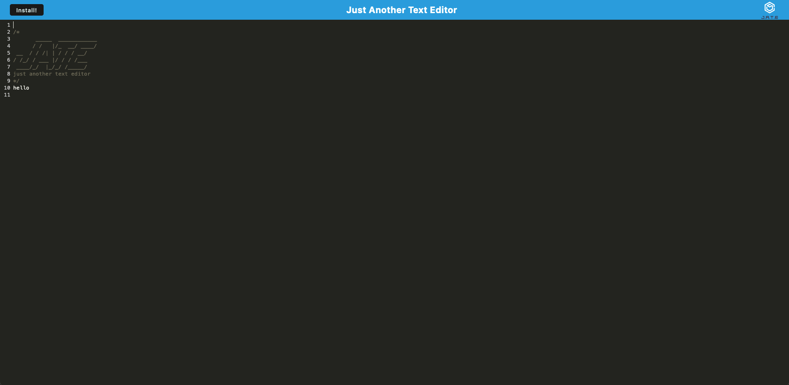

# Challenge-19-PWA-Text-Editor

  ## Table-of-Contents
  - [Description](#description)
  - [Installation](#installation)
  - [License](#license)
  - [Usage](#usage)
  - [Contribution](#contributing)
  - [Questions](#questions)
  
  ## Description 
  Let's go back to the basics of computing with a simple text editor. Spend hours typing line after line of text. Best of all no constant internet 
  connection needed! Utlizing PWAs you don't need a constant internet connection to type to your hearts content.
  
  ## Installation 
  Just click the deployed link and click install!
  
  ## License 
  [For more information about the license click here](https://choosealicense.com/licenses/mit/)
  
  ## Usage 
  Start typing right away. click install to type offline.
  
  ## Contribution 
  The repo is public so all are welcome to contribute if you’d like. Let me know if you’d like to help!
  
  ## Questions 
  If you have any questions at all feel free to contact me here or by email:
  
  [GitHub](https://github.com/jonrushing)

  [Email: jonrushingstuff@gmail.com](mailto:jonrushingstuff@gmail.com)

  ## Screenshots:
 
  

  ## Deployment Link:
  
  https://intense-bastion-61128.herokuapp.com/
